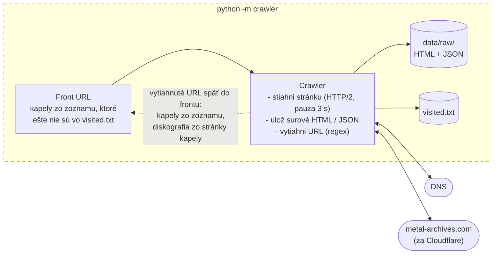
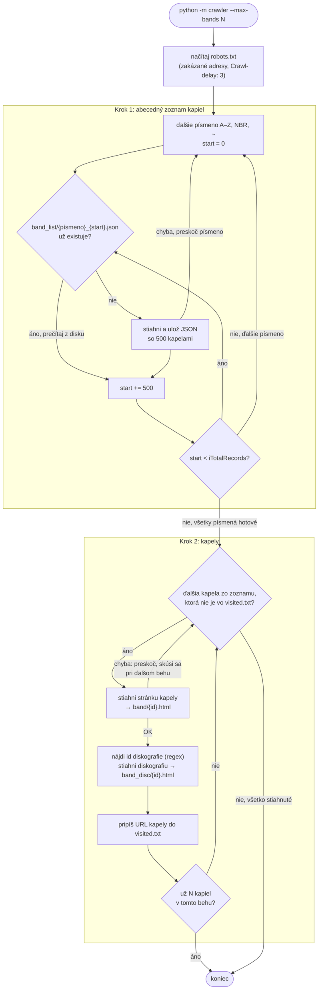
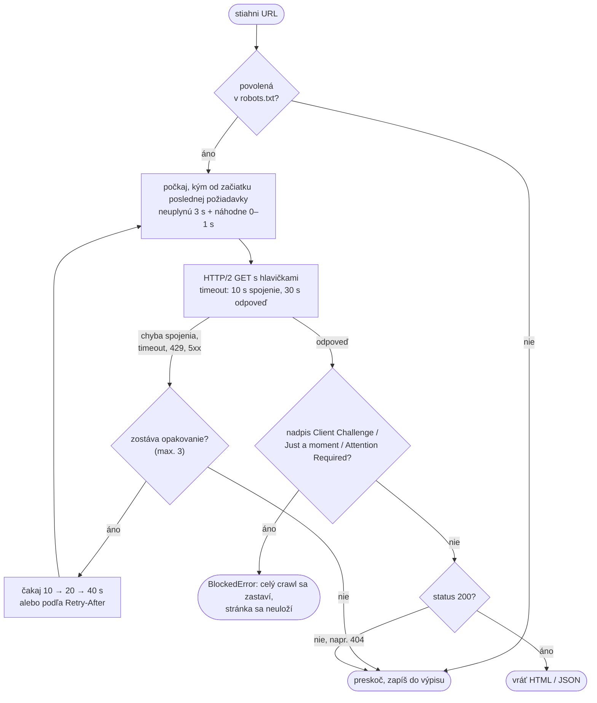

# Ako funguje crawler (krok za krokom)

Tento dokument vysvetľuje, čo crawler robí od spustenia až po uloženie poslednej stránky. Kód je v priečinku [`crawler/`](../crawler) a má štyri súbory:

| Súbor | Čo obsahuje |
|-------|-------------|
| [`config.py`](../crawler/config.py) | všetky nastavenia: adresa webu, hlavičky, timeouty, pauzy, cesty k súborom |
| [`fetcher.py`](../crawler/fetcher.py) | stiahnutie jednej URL: robots.txt, pauza medzi požiadavkami, opakovanie pri chybe, detekcia blokovania |
| [`crawler.py`](../crawler/crawler.py) | samotný crawl v dvoch krokoch: zoznam kapiel, potom kapely a ich diskografie |
| [`__main__.py`](../crawler/__main__.py) | spustenie z príkazového riadku |

## Celkový prehľad



Presný priebeh, vrátane všetkých rozhodnutí a chybových vetiev:



Každé jedno stiahnutie (v kroku 1 aj 2) ide cez ten istý `Fetcher`, ktorý dodržiava pauzu, robots.txt a opakovanie pri chybách.

---

## Krok 0: Spustenie

```bash
.venv/bin/python -m crawler --max-bands 1000
```

1. Python spustí [`__main__.py`](../crawler/__main__.py). Ten prečíta parameter `--max-bands`, teda koľko kapiel sa má v tomto behu stiahnuť (predvolene 100).
2. Nastaví sa výpis (logovanie) s časom pri každej správe. Vlastné správy knižnice `httpx` sa vypnú, aby výpis nebol zahltený.
3. Zavolá sa funkcia `crawl()` v [`crawler.py`](../crawler/crawler.py#L119).

## Krok 0b: Príprava – nastavenia a robots.txt

Funkcia `crawl()` najprv:

1. **Vytvorí priečinok `data/`**, ak ešte neexistuje.
2. **Vytvorí `Fetcher`** ([`fetcher.py`](../crawler/fetcher.py#L16)), teda HTTP klienta:
   - Používa knižnicu `httpx` s **HTTP/2**. Metal Archives je za Cloudflare, ktorý každému klientovi cez HTTP/1.1 vráti namiesto stránky kontrolu „Just a moment…". Cez HTTP/2 stránky prechádzajú normálne.
   - Pri každej požiadavke posiela hlavičky z [`config.py`](../crawler/config.py#L11):

     | Hlavička | Hodnota | Prečo |
     |----------|---------|-------|
     | `User-Agent` | `vinf-crawler/0.1 (+FIIT STU VINF school project)` | poctivo sa predstavíme ako crawler školského projektu, nie ako prehliadač |
     | `Accept` | `text/html,application/xhtml+xml;q=0.9,*/*;q=0.8` | chceme HTML (a pri zozname aj JSON) |
     | `Accept-Language` | `en-US,en;q=0.8` | anglická verzia stránok |
     | `Accept-Encoding` | `gzip, deflate` | server posiela stránky skomprimované, prenáša sa menej dát |

   - Nastaví **timeout**: 10 s na nadviazanie spojenia, 30 s na prečítanie odpovede. Ak server neodpovie, požiadavka nečaká donekonečna.
3. **Stiahne a spracuje robots.txt** ([`load_robots()`](../crawler/fetcher.py#L27)):
   - Zistí, ktoré adresy sú zakázané (`/affiliate/`, `/history/`, `/report/`, `/forum/`, `/users/`).
   - Prečíta `Crawl-delay: 3`. Pauza medzi požiadavkami bude väčšia z dvoch hodnôt: z robots.txt a z `MIN_DELAY` v konfigurácii (obe sú 3 s).

---

## Krok 1: Abecedný zoznam kapiel

Funkcia [`crawl_band_list()`](../crawler/crawler.py#L60).

**Prečo zoznam:** Metal Archives nemá sitemap, teda súbor so zoznamom všetkých stránok. Má však abecedný register kapiel (`/lists/A`, `/lists/B`, …). Tabuľku v ňom prehliadač dopĺňa z adresy, ktorá vracia JSON:

```
https://www.metal-archives.com/browse/ajax-letter/l/A/json/1?sEcho=1&iDisplayStart=0&iDisplayLength=500
```

- `l/A` – písmeno
- `iDisplayStart=0` – od ktorej kapely začať (0, 500, 1000, …)
- `iDisplayLength=500` – koľko kapiel vrátiť naraz (viac server nedá)

**Čo vráti jedna strana zoznamu:**

```json
{
  "iTotalRecords": 17009,
  "aaData": [
    ["<a href='https://www.metal-archives.com/bands/A_--_Solution/3540442600'>A // Solution</a>",
     "United States", "Crust Punk/Thrash Metal", "<span class=\"split_up\">Split-up</span>"],
    …
  ]
}
```

`iTotalRecords` je počet kapiel na dané písmeno, `aaData` je 500 riadkov: odkaz na kapelu, krajina, žáner, stav.

**Postup pre každé z 28 „písmen"** (A … Z, `NBR` pre mená začínajúce číslom, `~` pre ostatné znaky):

1. Začne sa od `start = 0`.
2. Zistí sa, či súbor `data/raw/band_list/{písmeno}_{start}.json` už existuje (napr. `A_000000.json`).
   - **Ak áno**, nič sa nesťahuje, súbor sa len prečíta z disku.
   - **Ak nie**, strana sa stiahne cez `Fetcher` a uloží sa do tohto súboru.
3. Z JSON sa prečíta `iTotalRecords`.
4. `start` sa zvýši o 500. Ak je stále menší ako `iTotalRecords`, pokračuje sa bodom 2 (ďalšia strana toho istého písmena). Inak sa prejde na ďalšie písmeno.
5. Ak stiahnutie strany zlyhá, zvyšok daného písmena sa v tomto behu preskočí. Pri ďalšom spustení sa chýbajúce strany stiahnu.

**Výsledok:** 419 súborov (~39 MB) so všetkými 201 787 kapelami. Prvý beh trvá ~25 minút, každý ďalší beh krok 1 prejde za zlomok sekundy, lebo všetky súbory už existujú.

---

## Krok 2: Kapely a ich diskografie

Funkcia [`crawl_bands()`](../crawler/crawler.py#L86).

### 2.1 Odkiaľ sa berú URL kapiel

Funkcia [`band_urls()`](../crawler/crawler.py#L77) prejde všetky uložené súbory zoznamu (v abecednom poradí súborov) a z prvého stĺpca každého riadku vytiahne URL kapely regulárnym výrazom:

```python
BAND_LINK = re.compile(r"href='(https://www\.metal-archives\.com/bands/[^']+/\d+)'")
```

Z `<a href='https://www.metal-archives.com/bands/A_--_Solution/3540442600'>A // Solution</a>` tak dostane `https://www.metal-archives.com/bands/A_--_Solution/3540442600`. Nepoužíva sa žiadny HTML parser (BeautifulSoup), len regulárne výrazy.

### 2.2 Čo už bolo stiahnuté

Na začiatku sa načíta súbor `data/visited.txt` do množiny (`set`). Obsahuje URL kapiel, ktoré už boli kompletne stiahnuté, jednu na riadok:

```
https://www.metal-archives.com/bands/A_--_Solution/3540442600
https://www.metal-archives.com/bands/A_12_Gauge_Tragedy/3540480258
…
```

Kontrola, či je URL v množine, je okamžitá aj pri 200 000 položkách.

### 2.3 Postup pre jednu kapelu

Pre každú URL z bodu 2.1:

1. **Je už v `visited.txt`?** Áno → preskočí sa, pokračuje sa ďalšou kapelou.
2. **Stiahne sa hlavná stránka kapely**, napr. `/bands/Kanonenfieber/3540483079`, a uloží sa do `data/raw/band/3540483079.html`. Ak stiahnutie zlyhá (404, chyba spojenia), kapela sa preskočí a do `visited.txt` sa **nezapíše**, takže sa skúsi znova pri ďalšom behu.
3. **Nájde sa id diskografie.** Na stránke kapely je odkaz `/band/discography/id/3540483079/tab/all`. Regulárny výraz z neho vytiahne číslo:

   ```python
   BAND_ID_IN_PAGE = re.compile(r"/band/discography/id/(\d+)/tab/all")
   ```

   Id sa berie **zo stránky, nie z URL**, pretože URL môže mať nesprávne id. Napríklad `/bands/Mastodon/9006` zobrazí Mastodon, hoci jeho skutočné id je 1361. Diskografia s id 9006 by vrátila 404.
4. **Stiahne sa diskografia** `/band/discography/id/{id}/tab/all` a uloží sa do `data/raw/band_disc/` pod rovnakým názvom ako stránka kapely (id z URL kapely), aby k sebe patriace súbory mali rovnaké meno. Diskografia je samostatná adresa, lebo stránka kapely ju do seba načítava až dodatočne. Obsahuje tabuľku všetkých vydaní: názov, typ (Full-length, EP, Single, …), rok a hodnotenie recenzií.
5. **URL kapely sa pripíše na koniec `visited.txt`** a pridá sa aj do množiny v pamäti. Zapisuje sa hneď po každej kapele, takže pri prerušení sa nič nestratí.
6. Vypíše sa riadok `[5] https://www.metal-archives.com/bands/...` (poradové číslo v tomto behu).
7. Ak už bolo v tomto behu stiahnutých `--max-bands` kapiel, krok 2 skončí.

Na jednu kapelu teda pripadajú **2 požiadavky** (stránka + diskografia).

---

## Stiahnutie jednej stránky (`Fetcher.get`)

Toto sa deje pri **každej** požiadavke, v kroku 1 aj 2. Najprv funkcia [`download()`](../crawler/crawler.py#L44) overí v robots.txt, či je URL povolená (`can_fetch`). Potom zavolá [`Fetcher.get()`](../crawler/fetcher.py#L46):

1. **Pauza** ([`_wait()`](../crawler/fetcher.py#L39)):
   - Vypočíta sa pauza = 3 s + náhodne 0 až 1 s (`JITTER`). Náhodná časť zabraňuje tomu, aby požiadavky chodili v presne pravidelnom rytme.
   - Ak od predchádzajúcej požiadavky ešte neuplynul tento čas, crawler počká zvyšok. Ak sťahovanie predchádzajúcej stránky trvalo dlho, čaká sa menej. Medzi začiatkami dvoch požiadaviek sú tak vždy aspoň 3 sekundy.
2. **Odoslanie požiadavky** cez HTTP/2 s hlavičkami a timeoutom z kroku 0b.
3. **Chyba spojenia alebo timeout:** počká sa 10 s a skúsi sa znova, potom 20 s, potom 40 s. Po štvrtom neúspechu sa chyba vráti do `download()`, ktorá ju zapíše do výpisu a crawler pokračuje ďalšou stránkou.
4. **Server odpovie 429 (príliš veľa požiadaviek) alebo 5xx (chyba servera):** rovnako sa čaká 10 → 20 → 40 s. Ak server v hlavičke `Retry-After` povie, koľko sekúnd čakať, použije sa jeho hodnota.
5. **Kontrola blokovania:** v prvých 5 000 znakoch odpovede sa hľadá nadpis anti-bot stránky (`Client Challenge`, `Just a moment`, `Attention Required`). Ak sa nájde, vyhodí sa `BlockedError` a **celý crawl sa zastaví**. Takáto stránka sa neuloží, aby sa v dátach neocitli kontrolné stránky namiesto skutočného obsahu.
6. **Inak sa odpoveď vráti.** `download()` skontroluje kód: 200 znamená úspech a vráti sa text stránky. Iný kód (napr. 404) sa zapíše do výpisu a vráti sa `None`.



---

## Ukončenie a pokračovanie

Crawl skončí v jednom z troch prípadov:

| Prípad | Čo sa stane |
|--------|-------------|
| Stiahnutých `--max-bands` kapiel | vypíše sa `hotovo: N kapiel v tomto behu, M spolu` |
| Ctrl+C | vypíše sa `prerusene pouzivatelom` |
| Anti-bot stránka | vypíše sa chyba `anti-bot challenge na …, crawl zastaveny` |

Vo všetkých troch prípadoch sú dáta v poriadku: každý súbor zoznamu aj každá kapela v `visited.txt` sa zapisuje okamžite. **Pri ďalšom spustení** krok 1 preskočí existujúce súbory zoznamu a krok 2 preskočí kapely z `visited.txt`. Crawl teda pokračuje presne tam, kde skončil.

Jediné, čo sa môže stiahnuť dvakrát, je kapela, pri ktorej bol crawl prerušený uprostred (stránka kapely už bola uložená, ale do `visited.txt` sa ešte nezapísala). Jej súbory sa pri ďalšom behu jednoducho prepíšu.

---

## Štruktúra stiahnutých dát

```
data/
├── visited.txt                  URL kompletne stiahnutých kapiel, jedna na riadok
└── raw/
    ├── band_list/               krok 1: abecedný zoznam (JSON)
    │   ├── A_000000.json        kapely 0–499 na písmeno A
    │   ├── A_000500.json        kapely 500–999 na písmeno A
    │   ├── …
    │   ├── NBR_000000.json      mená začínajúce číslom (napr. 1914)
    │   └── other_000000.json    ostatné znaky (písmeno „~")
    ├── band/                    krok 2: hlavné stránky kapiel (HTML)
    │   └── 3540483079.html      Kanonenfieber
    └── band_disc/               krok 2: diskografie (HTML)
        └── 3540483079.html      diskografia Kanonenfieber
```

Stránky sa ukladajú **surové, bez úprav**. Extrakcia údajov (krajina, žáner, členovia, albumy, …) je samostatný krok, ktorý pracuje už len so súbormi na disku. Ak sa extrakcia zmení alebo opraví, netreba nič sťahovať znova.

## Príklad výpisu

```
2026-10-03 21:51:01,650 INFO robots.txt nacitany, pauza medzi poziadavkami 3.0 s
2026-10-03 21:51:08,234 INFO [1] https://www.metal-archives.com/bands/A_Congregation_of_Horns/3540445071
2026-10-03 21:51:15,084 INFO [2] https://www.metal-archives.com/bands/A_Constant_Battle/3540414888
2026-10-03 21:51:22,532 INFO [3] https://www.metal-archives.com/bands/A_Constant_Knowledge_of_Death/3540510172
2026-10-03 21:51:22,532 INFO hotovo: 3 kapiel v tomto behu, 53 spolu
```

Medzi kapelami je ~7 sekúnd: dve požiadavky (stránka + diskografia), každá s pauzou 3 až 4 s.

## Ako dlho to trvá

| Čo | Požiadavky | Čas |
|----|------------|-----|
| Krok 1: celý zoznam | 419 | ~25 minút (len pri prvom behu) |
| Krok 2: 1 kapela | 2 | ~7 s |
| Krok 2: 1 000 kapiel | 2 000 | ~2 hodiny |
| Krok 2: všetkých 201 787 kapiel | ~403 600 | ~16 dní nepretržite |

Rýchlejšie to bez porušenia `Crawl-delay: 3` z robots.txt nejde. Sťahovanie sa preto dá rozdeliť na viac behov, napríklad:

```bash
.venv/bin/python -m crawler --max-bands 1000                                  # ~2 hodiny
nohup .venv/bin/python -m crawler --max-bands 300000 > crawl.log 2>&1 &       # beží na pozadí, kým nedokončí
```
