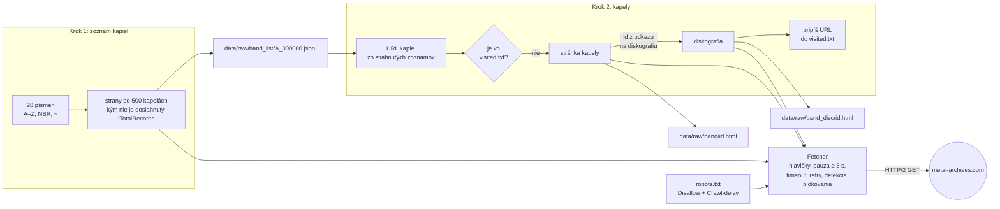

# Konzultácia 2: Crawler

## Zmena zdroja dát: last.fm → Metal Archives

Pôvodný plán bol crawlovať www.last.fm. Začiatkom októbra 2026 však last.fm nasadil anti-bot ochranu (Fastly „Client Challenge"). Každá stránka interpreta, albumu aj `+similar` teraz pre klienta bez JavaScriptu vráti HTTP 200 s 3 KB stránkou, ktorá obsahuje iba JavaScriptovú výzvu, nie dáta. Overili sme to z dvoch rôznych sietí s rôznymi User-Agentmi. Obchádzať túto ochranu (headless prehliadač, riešenie výzvy) nechceme, preto sme zdroj zmenili.

Z ďalších hudobných databáz (MusicBrainz, Discogs, AllMusic, RateYourMusic, AlbumOfTheYear, WhoSampled) blokujú obyčajné HTTP požiadavky všetky. **Encyclopaedia Metallum (www.metal-archives.com)** vracia serverom renderované HTML, robots.txt povoľuje stránky kapiel aj albumov a obsahuje takmer všetky polia z pôvodného návrhu:

| Údaj | Stránka | Príklad (Down) |
|------|---------|----------------|
| Názov, krajina, mesto | `/bands/{meno}/{id}` | Down, United States, New Orleans, Louisiana |
| Rok vzniku, roky aktivity, stav | `/bands/{meno}/{id}` | 1991; 1991–1996, 1999–2002, 2006–present; Active |
| Žáner, textové témy, label | `/bands/{meno}/{id}` | Southern/Sludge Metal; Personal struggles, Misery; Nuclear Blast |
| Členovia (aktuálni aj bývalí, s nástrojmi) | `/bands/{meno}/{id}` | Phil Anselmo, Pepper Keenan, … |
| Plný popisný text (biografia) | `/band/read-more/id/{id}` | text pre full-textový index |
| Diskografia (názov, typ, rok, recenzie) | `/band/discography/id/{id}/tab/all` | NOLA, Full-length, 1995, 17 recenzií (87 %) |
| Album: presný dátum, label, zoznam skladieb | `/albums/{kapela}/{album}/{id}` | NOLA, 19. 9. 1995 |
| Podobní interpreti (s hodnotením používateľov) | `/band/ajax-recommendations/id/{id}?showMoreSimilar=1` | Crowbar, Corrosion of Conformity, Pantera |

Oproti last.fm prichádzame o počty poslucháčov a scrobblov. Získavame však presnejšie faktografické polia a hodnotenia albumov z recenzií. Obmedzenie: databáza obsahuje len metalové kapely. Druhá fáza (obohatenie z Wikipédie) zostáva rovnaká, párovanie prebieha cez meno kapely a krajinu.

## 1. Aké frameworky chceme používať?

| Časť | Nástroj | Prečo |
|------|---------|-------|
| Jazyk | Python 3.12 | |
| HTTP | `httpx` s HTTP/2 | jediná externá závislosť crawlera; Cloudflare pred Metal Archives vracia challenge každému HTTP/1.1 klientovi (aj `requests` a `curl --http1.1`), cez HTTP/2 stránky prechádzajú |
| robots.txt | `urllib.robotparser` (štandardná knižnica) | kontrola `Disallow` aj `Crawl-delay` |
| Extrakcia odkazov a dát | `re` (regulárne výrazy), `json` pre abecedný zoznam kapiel | bez BeautifulSoup/Scrapy, crawler aj parser sú vlastná implementácia |
| Ukladanie | súbory HTML/JSON + textový súbor so stiahnutými kapelami | jednoduché, dá sa kedykoľvek znova parsovať bez opätovného sťahovania |
| Index, 1. fáza | vlastný invertovaný index v Pythone (TF-IDF / BM25) | |
| Wikipédia, 2. fáza | dump `enwiki-pages-articles` + Apache Spark (PySpark) | spracovanie veľkého dumpu a join s kapelami |
| Index, 2. fáza | PyLucene | full-text vyhľadávanie nad spojenými dátami |
| Prostredie | Docker | Spark a PyLucene v kontajneri |

## 2. Architektúra crawl systému

Metal Archives nemá sitemap. Úplný zoznam kapiel však ponúka abecedný register (`/lists/A` … `/lists/Z`, `/lists/NBR` pre mená začínajúce číslom a `/lists/~` pre ostatné znaky). Tabuľku v ňom stránka dopĺňa z adresy `/browse/ajax-letter/l/{písmeno}/json/1`, ktorá vracia JSON s 500 kapelami na požiadavku (URL kapely, krajina, žáner, stav). robots.txt ju nezakazuje. Crawler preto začína týmito 28 zoznamami a nepotrebuje žiadne štartovacie kapely.

Pre každú kapelu sa zatiaľ sťahujú dve stránky: hlavná stránka kapely a jej diskografia. Podobné kapely, plná biografia a stránky albumov sa v tejto fáze nesťahujú.

Crawler beží v dvoch krokoch. Keďže poradie stránok je vopred dané (zoznam → kapela → jej diskografia), nepotrebuje všeobecný front URL adries.



- **Krok 1, zoznam kapiel:** pre každé písmeno sa sťahujú strany zoznamu (`iDisplayStart` = 0, 500, 1000, …), kým nie je dosiahnutý počet kapiel `iTotalRecords` z prvej odpovede. Každá strana sa uloží ako JSON. Strany, ktoré už na disku sú, sa znova nesťahujú. Celý zoznam má 419 strán (~25 minút).
- **Krok 2, kapely:** URL kapiel sa čítajú priamo z uložených JSON súborov zoznamu. Pre každú kapelu, ktorá ešte nie je v `data/visited.txt`, sa stiahne hlavná stránka a hneď za ňou diskografia. Až potom sa URL kapely pripíše do `visited.txt`.
- **Čo už bolo stiahnuté:** jediným stavom crawlera je `data/visited.txt`, jedna URL kapely na riadok. Žiadna kapela sa tak nestiahne dvakrát a crawl sa dá kedykoľvek prerušiť (Ctrl+C). Pri ďalšom spustení pokračuje tam, kde skončil.
- **Id kapely** sa berie zo stránky (z odkazu na diskografiu), nie z URL. Stránka `/bands/Mastodon/9006` totiž zobrazí Mastodon aj s nesprávnym id (skutočné je 1361) a diskografia postavená z id v URL by vrátila 404.
- **Blokovanie:** ak server namiesto obsahu vráti anti-bot stránku („Client Challenge", „Just a moment…"), crawler ju neuloží ako dáta a skončí.

## 3. Hlavičky, timeout, pauza

| Nastavenie | Hodnota |
|------------|---------|
| `User-Agent` | `vinf-crawler/0.1 (+FIIT STU VINF school project)`, poctivo sa identifikujeme ako crawler |
| `Accept` | `text/html,application/xhtml+xml;q=0.9,*/*;q=0.8` |
| `Accept-Language` | `en-US,en;q=0.8` |
| `Accept-Encoding` | `gzip, deflate` |
| Protokol | HTTP/2, jedno spojenie pre celý crawl (`httpx.Client`) |
| Timeout | 10 s na pripojenie, 30 s na čítanie odpovede |
| Pauza medzi požiadavkami | 3 s (`Crawl-delay: 3` z robots.txt) + náhodne 0–1 s |
| Opakovanie | max. 3× pri chybe spojenia, timeoute, 429 a 5xx; čakanie 10 s → 20 s → 40 s, prípadne podľa hlavičky `Retry-After` |
| 404 a iné chyby | zalogujú sa a crawler pokračuje ďalšou kapelou; kapela sa nezapíše do `visited.txt`, takže sa pri ďalšom behu skúsi znova |
| robots.txt | pred každou URL `can_fetch()`; zakázané sú `/affiliate/`, `/history/`, `/report/`, `/forum/`, `/users/` |

Pri pauze ~3,5 s to vychádza na približne 1 000 stránok za hodinu. Na jednu kapelu pripadajú 2 stránky, čiže ~500 kapiel za hodinu. Celý register (201 787 kapiel) je ~400 000 stránok, teda približne 16 dní nepretržitého sťahovania.

## 4. Implementácia a stiahnuté stránky

Kód je v priečinku [`crawler/`](../crawler):

| Súbor | Úloha |
|-------|-------|
| `config.py` | hlavičky, timeouty, pauzy, cesty |
| `fetcher.py` | HTTP klient, robots.txt, rate limiting, retry, detekcia blokovania |
| `crawler.py` | krok 1 (zoznam kapiel) a krok 2 (kapela + diskografia), extrakcia odkazov regulárnymi výrazmi |
| `__main__.py` | spustenie z príkazového riadku |

Spustenie:

```bash
pip install -r requirements.txt
python -m crawler --max-bands 1000   # kapely z data/visited.txt preskočí
```

Doterajší crawl je v [`data/raw/`](../data/raw):

| Priečinok | Počet súborov | Veľkosť | Obsah |
|-----------|---------------|---------|-------|
| `band_list/` | 419 | 39 MB | celý abecedný zoznam: 201 787 kapiel s krajinou, žánrom a stavom |
| `band/` | 53 | 1,2 MB | hlavné stránky prvých kapiel podľa abecedy (A // Solution … A Constant Knowledge of Death) |
| `band_disc/` | 53 | 0,2 MB | ich diskografie |

Stiahnuté kapely sú v [`data/visited.txt`](../data/visited.txt).
